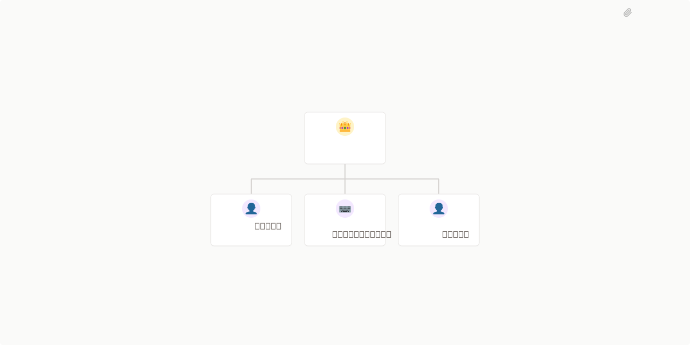

# Brand Intelligence Lab



## What's Inside

> This is an [Agent Company](https://agentcompanies.io) package from [Paperclip](https://paperclip.ing)

| Content | Count |
|---------|-------|
| Agents | 4 |
| Projects | 4 |
| Skills | 12 |

### Agents

| Agent | Role | Reports To |
|-------|------|------------|
| 브랜드 리서처 | researcher | ceo |
| 슬라이드 제작자 | Engineer | ceo |
| 데이터 분석가 | general | ceo |
| CEO | CEO | — |

### Projects

- **Onboarding**
- **슬라이드 빌더** — Marp (또는 Reveal.js)로 마크다운 → 슬라이드 12\~15장 → PDF·HTML 빌드.

디자인 가드(단테랩스 paper+ink+rust)는 슬라이드 제작자 capabilities에 내장.
- **브랜드 리서치 시스템** — Bright Data 3종 게이트를 통합해 {BRAND} + {COMPETITORS} 의 정성·정량 데이터를

한 번의 task 안에서 수집·구조화하는 파이프라인
- **분석 + SWOT + 팩트 체크** — pandas/plotly로 정제·통합·분석. 자동 SWOT 도출 + Bright Data 재 fetch 기반 팩트 체크.

### Skills

| Skill | Description | Source |
|-------|-------------|--------|
| brand-research-glossary | B2C 브랜드 시장조사 산출물에서 표기·용어 일관성을 보장하는 회사 공통 용어 사전. 무신사·29CM·W컨셉·LF몰 등 한국 e-커머스/패션 브랜드 표기, Bright Data 제품 명칭(Web Unlocker · SERP API · Datasets · Scraping Browser), Marp/Reveal.js 슬라이드 형식 명칭을 통일한다. Brand Intelligence Lab 모든 에이전트가 상속한다. | [github](https://github.com/dandacompany/dante-skills/tree/main/brand-research-glossary) |
| marp-slide-build | Marp 마크다운으로 임원 보고용 시장조사 보고서 슬라이드 12~15장을 빌드해 PDF·HTML로 출력하는 표준 패턴. 단테랩스 paper+ink+rust 디자인 가드와 12장 구성 골격을 강제한다. Brand Intelligence Lab 의 슬라이드 제작자 에이전트가 사용한다. | [github](https://github.com/dandacompany/dante-skills/tree/main/marp-slide-build) |
| report-evidence-citation | 모든 산출물에서 인용·근거를 보존하고 사실/의견을 분리하는 회사 공통 규칙. 출처 URL 누락, 추측 어휘 사용, 비공식 평가 발언을 차단한다. Brand Intelligence Lab 모든 에이전트가 상속한다. | [github](https://github.com/dandacompany/dante-skills/tree/main/report-evidence-citation) |
| swot-from-signals | 브랜드 리서처가 수집한 정성·정량 신호로부터 SWOT(강점·약점·기회·위협) 매트릭스를 자동 도출하는 분석 패턴. 각 사분면 3개씩, 모든 항목에 근거 URL 또는 시그널 값을 명시한다. Brand Intelligence Lab 의 데이터 분석가 에이전트가 사용한다. | [github](https://github.com/dandacompany/dante-skills/tree/main/swot-from-signals) |
| diagnose-why-work-stopped | > | [github](https://github.com/paperclipai/paperclip/tree/master/skills/diagnose-why-work-stopped) |
| paperclip-converting-plans-to-tasks | > | [github](https://github.com/paperclipai/paperclip/tree/master/skills/paperclip-converting-plans-to-tasks) |
| paperclip-create-agent | > | [github](https://github.com/paperclipai/paperclip/tree/master/skills/paperclip-create-agent) |
| paperclip-create-plugin | > | [github](https://github.com/paperclipai/paperclip/tree/master/skills/paperclip-create-plugin) |
| paperclip-dev | > | [github](https://github.com/paperclipai/paperclip/tree/master/skills/paperclip-dev) |
| paperclip | > | [github](https://github.com/paperclipai/paperclip/tree/master/skills/paperclip) |
| para-memory-files | > | [github](https://github.com/paperclipai/paperclip/tree/master/skills/para-memory-files) |
| terminal-bench-loop | > | [github](https://github.com/paperclipai/paperclip/tree/master/skills/terminal-bench-loop) |

## Getting Started

```bash
# 한 줄로 회사 + 4 agents + 4 projects + 16 skills 셋업
paperclipai company import https://github.com/dandacompany/brand-intelligence-lab --ref master --yes
```

### Import 가 채우지 않는 것 — Goals

> **주의**: 현재 `paperclipai/v1` 매니페스트 schema 는 **Goals** (최상위 목표 + 세부 목표 트리) 를 portable 하게 표현하지 못합니다. 회사 import 는 회사·에이전트·프로젝트·스킬만 셋업하고, **goals 는 비어 있는 상태**로 시작합니다.
>
> 영상 튜토리얼의 **§04 (최상위 목표 등록)** 과 **§05 (세부 목표 3개)** 단계에서 페이퍼클립 콘솔 GUI 로 직접 만들거나, 또는 4개의 POST API 호출로 셋업할 수 있습니다.
>
> Goals 셋업 후에는 각 Project 를 PATCH 로 해당 세부 goal 에 연결해 주세요 (콘솔의 Project 설정 또는 `PATCH /api/projects/{id}` 의 `goalId` 필드).

See [Paperclip](https://paperclip.ing) for more information.

---
Exported from [Paperclip](https://paperclip.ing) on 2026-05-21
